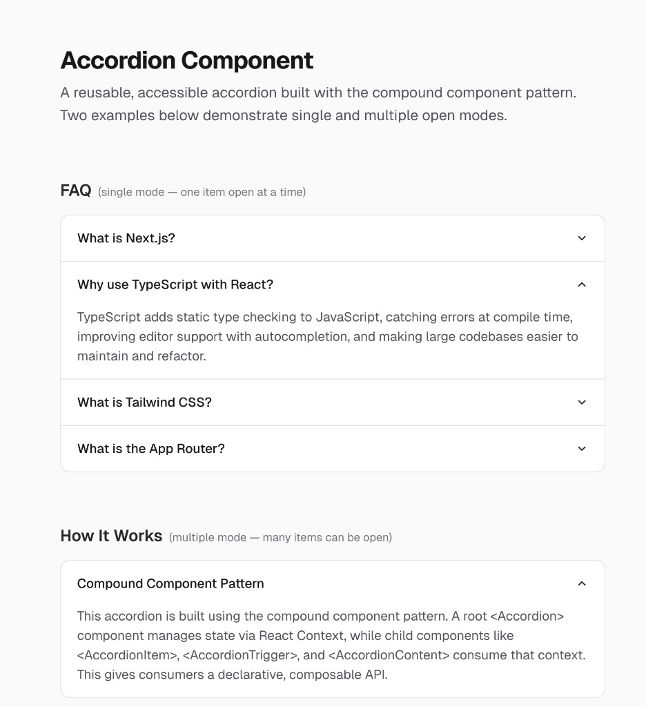

# React Accordion Component

A reusable, accessible accordion component built with the **compound component pattern** in Next.js 16 and React 19.



## Features

- **Single & multiple modes** — allow only one item open at a time, or let users open many simultaneously
- **Compound component API** — declarative, composable usage with `<Accordion>`, `<AccordionItem>`, `<AccordionTrigger>`, and `<AccordionContent>`
- **Accessible** — native `<button>` triggers with `aria-expanded`, `aria-controls`, `role="region"`, and `aria-labelledby`
- **Smooth animation** — CSS `grid-template-rows` transition for fluid height changes without JavaScript measurement
- **Fully typed** — written in TypeScript with exported prop types
- **Styled with Tailwind CSS v4** — easy to customize via className props

## Usage

```tsx
import {
  Accordion,
  AccordionItem,
  AccordionTrigger,
  AccordionContent,
} from "@/components/ui/accordion";

// Single mode (one open at a time)
<Accordion type="single" defaultValue="item-1">
  <AccordionItem value="item-1">
    <AccordionTrigger>Is it accessible?</AccordionTrigger>
    <AccordionContent>
      Yes — it uses native button elements and ARIA attributes.
    </AccordionContent>
  </AccordionItem>
  <AccordionItem value="item-2">
    <AccordionTrigger>Is it animated?</AccordionTrigger>
    <AccordionContent>
      Yes — it uses a CSS grid-row transition for smooth height changes.
    </AccordionContent>
  </AccordionItem>
</Accordion>

// Multiple mode (many open at once)
<Accordion type="multiple">
  {/* ...items */}
</Accordion>
```

## Component API

| Component | Props | Description |
|---|---|---|
| `Accordion` | `type?: "single" \| "multiple"`, `defaultValue?: string \| string[]`, `className?` | Root wrapper that manages open/close state |
| `AccordionItem` | `value: string`, `className?` | Wraps a single collapsible section |
| `AccordionTrigger` | `className?` | Clickable header button with chevron icon |
| `AccordionContent` | `className?` | Collapsible body with animated height transition |

## Tech Stack

- [Next.js](https://nextjs.org) 16.1.5 (App Router)
- [React](https://react.dev) 19.0.4
- [TypeScript](https://www.typescriptlang.org) 5
- [Tailwind CSS](https://tailwindcss.com) 4.1.18

## Getting Started

```bash
# Install dependencies
npm install

# Start development server
npm run dev

# Build for production
npm run build
```

Open [http://localhost:3000](http://localhost:3000) to see the demo with two examples:

1. **FAQ** — single mode accordion where only one item can be open at a time
2. **How It Works** — multiple mode accordion where several items can be open simultaneously

## Project Structure

```
src/
├── app/
│   ├── globals.css        # Tailwind imports + accordion animation utility
│   ├── layout.tsx         # Root layout with metadata and fonts
│   └── page.tsx           # Demo page with two accordion examples
└── components/
    └── ui/
        └── accordion.tsx  # Reusable accordion compound component
```
